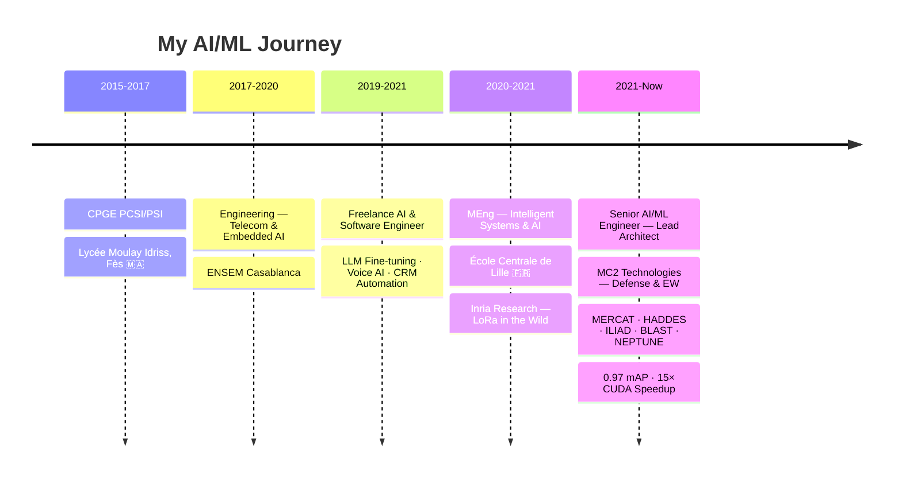

<!-- ═══════════════════════════════════════════════════════════════════════════════ -->
<!-- 🔮 HEADER — Animated Wave SVG + Typing Effect                                -->
<!-- ═══════════════════════════════════════════════════════════════════════════════ -->


<!-- ═══════════════════════════════════════════════════════════════════════════════ -->
<!-- ⚡ TYPING ANIMATION                                                           -->
<!-- ═══════════════════════════════════════════════════════════════════════════════ -->

<div align="center">

[](https://git.io/typing-svg)

</div>

<!-- Animated line separator -->


<!-- ═══════════════════════════════════════════════════════════════════════════════ -->
<!-- 🧬 ABOUT ME                                                                   -->
<!-- ═══════════════════════════════════════════════════════════════════════════════ -->

##  &nbsp;About Me

```python
class OussamaSalhi:
    """Senior AI/ML Engineer — Building Intelligence That Ships"""
    
    def __init__(self):
        self.role       = "Senior AI/ML Engineer & Lead Architect"
        self.company    = "MC2 Technologies — Defense & Electronic Warfare"
        self.location   = "Lille, France 🇫🇷  ·  From Morocco 🇲🇦"
        self.education  = ["École Centrale de Lille (Grande École)", "ENSEM Casablanca"]
        
        self.languages  = {
            "production":  ["Python", "C/C++", "CUDA"],
            "web":         ["TypeScript", "JavaScript", "Next.js"],
            "data":        ["SQL", "Bash"]
        }
    
    def current_focus(self):
        return [
            "🛡️  Deploying real-time AI on embedded defense systems",
            "🧠  GRPO reinforcement learning on LLMs (Qwen-3B)",
            "🎯  Production CV — 0.97 mAP on 468K instances",
            "📐  MathPrepa.app — 1,300+ active students",
            "🔤  FontForge Studio — AI-powered font generation",
        ]
    
    def fun_fact(self):
        return "I wrote CUDA kernels that made drone detection 15× faster 🚀"
```

<!-- ═══════════════════════════════════════════════════════════════════════════════ -->
<!-- 🏆 TROPHY SHELF                                                               -->
<!-- ═══════════════════════════════════════════════════════════════════════════════ -->


##  &nbsp;Achievements

<div align="center">

| 🎯 Metric | 📊 Value | 🔬 Context |
|:---:|:---:|:---|
| **mAP50** | `0.97` | Production CV · 468K instances · Defense platforms |
| **Precision/Recall** | `0.98 / 0.98` | UAV detection · Zero false alarms |
| **Inference Speedup** | `15×` | Custom CUDA/C++ kernels · 30s → 2s |
| **Active Users** | `1,300+` | MathPrepa.app · Live EdTech platform |
| **Kaggle NLP** | `Top 10%` | DeBERTa · Score 0.926 |
| **Defense Programs** | `6` | Concurrent · MERCAT · HADDES · ILIAD · BLAST · NEPTUNE |

</div>

<div align="center">
  
</div>

<!-- ═══════════════════════════════════════════════════════════════════════════════ -->
<!-- 🔧 TECH ARSENAL                                                               -->
<!-- ═══════════════════════════════════════════════════════════════════════════════ -->


##  &nbsp;Tech Arsenal

<div align="center">

### 🧠 AI / ML / Deep Learning
<p>
  
  
  
  
  
  
  
</p>

### 🤖 LLMs & Generative AI
<p>
  
  
  
  
  
  
</p>

### 💻 Languages & Frameworks
<p>
  
  
  
  
  
  
  
</p>

### ☁️ MLOps & Infrastructure
<p>
  
  
  
  
  
  
  
</p>

### 📡 Signal Processing & Voice
<p>
  
  
  
  
  
</p>

</div>

<!-- ═══════════════════════════════════════════════════════════════════════════════ -->
<!-- 🚀 FLAGSHIP PROJECTS                                                          -->
<!-- ═══════════════════════════════════════════════════════════════════════════════ -->


##  &nbsp;Flagship Projects

<div align="center">
<table>
<tr>
<td width="50%">

### 🛡️ MERCAT & HADDES
**Deployed Defense AI Platforms**
<br>

```
📡 400 MHz – 7.2 GHz coverage
🎯 0.97 mAP50 · 468K instances
🔒 0.98 precision · zero false alarms
⚡ 15× speedup via CUDA kernels
🌐 360° drone detection at 20 km
```

`PyTorch` `CUDA/C++` `YOLO` `Docker` `GitLab CI`

</td>
<td width="50%">

### 📐 MathPrepa.app
**Live EdTech Platform · 1,300+ Users**
<br>

```
🧠 RAG + LLM-powered tutoring
📊 Adaptive skill tracking
🔄 Spaced repetition engine
✏️ Custom LaTeX renderer
🎯 Automated exam scoring
```

`Next.js` `React` `Python` `LLM` `RAG`

</td>
</tr>
<tr>
<td width="50%">

### 🔤 FontForge Studio
**AI-Powered Font Design Tool**
<br>

```
🎨 Draw 1 letter → AI generates 26
👁️ CV contour detection + vectorization
🤖 LLM-powered glyph generation
📝 OCR-based image letter extraction
✅ Exports production OTF/TTF fonts
```

`Python` `OpenCV` `FontForge` `Potrace` `LLM`

</td>
<td width="50%">

### 🎙️ OctetX
**AI Voice Agent for Restaurants**
<br>

```
🗣️ Fine-tuned GenAI voice assistant
🔇 Custom noise suppression (DSP)
📞 Twilio VoIP real-time handling
🔄 Live CRM synchronization
🤖 Autonomous reservation booking
```

`GenAI` `STT/TTS` `Twilio` `Python` `REST`

</td>
</tr>
</table>
</div>

<!-- ═══════════════════════════════════════════════════════════════════════════════ -->
<!-- 🐍 CONTRIBUTION SNAKE                                                         -->
<!-- ═══════════════════════════════════════════════════════════════════════════════ -->


##  &nbsp;GitHub Activity

<div align="center">

<!-- Replace 'Osalhi-7X' with your actual GitHub username -->
<picture>
  <source media="(prefers-color-scheme: dark)" srcset="https://raw.githubusercontent.com/Osalhi-7X/Osalhi-7X/output/github-snake-dark.svg" />
  <source media="(prefers-color-scheme: light)" srcset="https://raw.githubusercontent.com/Osalhi-7X/Osalhi-7X/output/github-snake.svg" />
  
</picture>

</div>

<br>

<div align="center">
  
  &nbsp;&nbsp;
  
</div>

<br>

<div align="center">
  
  &nbsp;&nbsp;
  
</div>

<!-- ═══════════════════════════════════════════════════════════════════════════════ -->
<!-- 🧠 EXPERIENCE TIMELINE                                                        -->
<!-- ═══════════════════════════════════════════════════════════════════════════════ -->


##  &nbsp;Journey



<!-- ═══════════════════════════════════════════════════════════════════════════════ -->
<!-- 📫 CONNECT                                                                    -->
<!-- ═══════════════════════════════════════════════════════════════════════════════ -->


##  &nbsp;Let's Connect

<div align="center">
  <a href="mailto:salhioussama239@gmail.com">
    
  </a>
  &nbsp;
  <a href="https://linkedin.com/in/Osalhi-7X">
    
  </a>
  &nbsp;
  <a href="https://kaggle.com/oussamasalhi">
    
  </a>
  &nbsp;
  <a href="https://mathprepa.app">
    
  </a>
</div>

<br>

<div align="center">

```
💡 "I don't just train models — I deploy them where failure isn't an option."
```

</div>

<div align="center">
  
</div>

<br>

<!-- FOOTER WAVE -->

